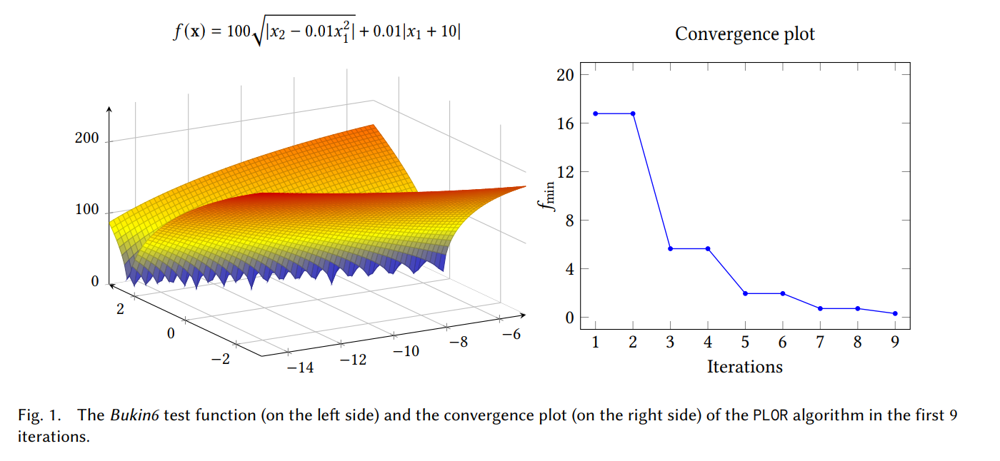

# DIRECTGO
**DIRECTGO**: A new **DIRECT**-type `MATLAB` toolbox for derivative-free **G**lobal **O**ptimization [[29]](https://arxiv.org/abs/2107.02205)

---

## Quick Overview

The sequential [[1](http://www4.ncsu.edu/~ctk/Finkel_Direct/), [26](https://doi.org/10.1023/A:1019992822938), [27](https://doi.org/10.1016/j.amc.2020.125596)] and parallel implementations [[27]](https://doi.org/10.1016/j.amc.2020.125596) of various DIRECT-type algorithms. The toolbox consists of two main parts:

- **DIRECTGO.mltbx** - `MATLAB` toolbox package containing implementations of DIRECT-type algorithms, including an extensive [DIRECTGOLib](https://github.com/blockchain-group/DIRECTGOLib) [[28]](https://github.com/blockchain-group/DIRECTGOLib) library (maintained separately) of the box, generally constrained, and practical engineering global optimization problems, often used for benchmarking DIRECT-type algorithms.
- **DIRECTGO.mlappinstall** - A single `MATLAB` app installer file containing everything necessary to install and run the **DIRECTGO** toolbox, including a graphical user interface (GUI).

Additionally, we provide source files of all implemented algorithms in the [Algorithms/](Algorithms/) folder.

## Versions history

- **DIRECTGO** [v1.2.0](https://github.com/blockchain-group/DIRECTGO/releases/tag/v1.2.0) incorporates thirteen new algorithms introduced in [[31\]](https://doi.org/10.1007/s10898-023-01296-7) and [[32\]](https://doi.org/10.3390/math11132920). With these additions, the total number of algorithms in **DIRECTGO** reaches 61.
- **DIRECTGO** [v1.1.0](https://github.com/blockchain-group/DIRECTGO/releases/tag/v1.1.0) now comprises twelve additional algorithms introduced in [[30\]](https://doi.org/10.1007/s10898-022-01185-5). With these new additions, the total number of algorithms in **DIRECTGO** amounts to 48.
- The **DIRECTGO** [v1.0.0](https://github.com/blockchain-group/DIRECTGO/releases/tag/v1.0.0) version, as described in [[29\]](https://arxiv.org/abs/2107.02205), includes the implementation of 36 distinct DIRECT-type algorithms.

## Algorithms within DIRECTGO

Categorization of 61 implemented DIRECT-type algorithms present in various versions of **DIRECTGO**:


| Version                                                      | Problem type          | Algorithm name & [References]                                |
| ------------------------------------------------------------ | --------------------- | ------------------------------------------------------------ |
| [v1.2.0](https://github.com/blockchain-group/DIRECTGO/releases/tag/v1.2.0) | Box constrained       | Twelve versions of the HALRECT algorithm [[31]](https://doi.org/10.1007/s10898-023-01296-7). |
| [v1.2.0](https://github.com/blockchain-group/DIRECTGO/releases/tag/v1.2.0) | Linearly constrained  | mBIRECTv-GL [[32]](https://doi.org/10.3390/math11132920).    |
| [v1.1.0](https://github.com/blockchain-group/DIRECTGO/releases/tag/v1.1.0) | Box constrained       | I_DBDP_GL [[30]](https://doi.org/10.1007/s10898-022-01185-5), I_DBDP_IA [[30]](https://doi.org/10.1007/s10898-022-01185-5), I_DBDP_IO [[30]](https://doi.org/10.1007/s10898-022-01185-5), I_DTC_GL [[30]](https://doi.org/10.1007/s10898-022-01185-5), I_DTC_IA [[30]](https://doi.org/10.1007/s10898-022-01185-5), I_DTC_IO [[30]](https://doi.org/10.1007/s10898-022-01185-5), I_DTDV_IA [[30]](https://doi.org/10.1007/s10898-022-01185-5), I_DTDV_GL [[30]](https://doi.org/10.1007/s10898-022-01185-5), I_DTDV_IO [[30]](https://doi.org/10.1007/s10898-022-01185-5), N_DTC_GL [[30]](https://doi.org/10.1007/s10898-022-01185-5), N_DTC_IA [[30]](https://doi.org/10.1007/s10898-022-01185-5), N_DTC_IO [[30]](https://doi.org/10.1007/s10898-022-01185-5). |
| [v1.0.0](https://github.com/blockchain-group/DIRECTGO/releases/tag/v1.0.0) | Box constrained       | DIRECT v4.0 [[1](http://www4.ncsu.edu/~ctk/Finkel_Direct/), [2](https://doi.org/10.1007/BF00941892)], DIRECT-restart [[3]](https://repository.lib.ncsu.edu/handle/1840.4/461), DIRECT-m [[4]]( https://doi.org/10.1007/s10898-006-9029-9), DIRECT-l [[5]](https://doi.org/10.1023/A:1017930332101), DIRECT-rev [[6]](http://www4.ncsu.edu/~ctk/Finkel_Direct/), DIRECT-a [[7]](https://doi.org/10.1007/s10898-012-9952-x), DIRMIN [[8]](https://doi.org/10.1007/s10589-008-9217-2), PLOR [[9]](https://doi.org/10.1007/s10898-015-0364-6), glbSolve [[2](https://doi.org/10.1007/BF00941892), [10](https://www.mat.univie.ac.at/~neum/glopt/mss/BjoeH99.pdf)], glbSolve-sym [[11]](https://doi.org/10.1007/s10898-012-0020-3), glbSolve-sym2 [[11]](https://doi.org/10.1007/s10898-012-0020-3), MrDIRECT [[12]](https://doi.org/10.1007/s10898-016-0447-z), MrDIRECT075 [[13]](https://doi.org/10.1007/s10898-014-0241-8), BIRECT [[14]](https://doi.org/10.1007/s10898-016-0485-6), GB-DISIMPL-C [[15]](https://doi.org/10.1007/s10898-014-0180-4), GB-DISIMPL-V [[15]](https://doi.org/10.1007/s10898-014-0180-4), Gb-BIRECT [[16]](https://doi.org/10.1016/j.eswa.2019.113052), BIRMIN [[16]](https://doi.org/10.1016/j.eswa.2019.113052), Gb-glbSolve [[16]](https://doi.org/10.1016/j.eswa.2019.113052), DISIMPL-C [[17]](https://doi.org/10.1007/s10898-013-0089-3), DISIMPL-V [[17]](https://doi.org/10.1007/s10898-013-0089-3), ADC [[18]](https://doi.org/10.1137/040621132), Aggressive DIRECT [[19]](%5Bdownload%20(psu.edu)%5D(https://citeseerx.ist.psu.edu/viewdoc/download?doi=10.1.1.63.280&rep=rep1&type=pdf)), DIRECT-G [[20]](https://doi.org/10.1007/s11590-017-1228-4), DIRECT-L [[20]](https://doi.org/10.1007/s11590-017-1228-4), DIRECT-GL [[20]](https://doi.org/10.1007/s11590-017-1228-4). |
| [v1.0.0](https://github.com/blockchain-group/DIRECTGO/releases/tag/v1.0.0) | Linearly constrained  | Lc-DISIMPL-C [[21]](https://doi.org/10.1007/s11590-014-0772-4), Lc-DISIMPL-V [[21]](https://doi.org/10.1007/s11590-014-0772-4). |
| [v1.0.0](https://github.com/blockchain-group/DIRECTGO/releases/tag/v1.0.0) | Generally constrained | DIRECT-L1 [[1]](http://www4.ncsu.edu/~ctk/Finkel_Direct/), DIRECT-GLc [[22]](https://doi.org/10.1007/s00158-018-2181-2), DIRECT-GLce [[22]](https://doi.org/10.1007/s00158-018-2181-2), DIRECT-GLce-min [[22]](https://doi.org/10.1007/s00158-018-2181-2). |
| [v1.0.0](https://github.com/blockchain-group/DIRECTGO/releases/tag/v1.0.0) | Hidden constraints    | DIRECT-NAS [[1]](http://www4.ncsu.edu/~ctk/Finkel_Direct/), DIRECT-Barrier [[23]](%5BModification%20of%20the%20DIRECT%20Algorithm%20(ncsu.edu)%5D(https://repository.lib.ncsu.edu/bitstream/handle/1840.16/3920/etd.pdf?sequence=1)), subDIRECT-Barrier [[24]](https://doi.org/10.1016/j.energy.2017.03.047), DIRECT-GLh [[25]](https://doi.org/10.1007/s11590-021-01726-z). |

## Quick user guide

After installation of the `MATLAB` toolbox (using **DIRECTGO.mltbx**), all implemented DIRECT-type algorithms and test problems can be freely accessed in the command window of `MATLAB`. Unlike GUI, algorithms from the command line require more programming knowledge, and configurations must be done manually. All algorithms can be run using the same style and syntax:

```matlab
1. f_min = algorithm(P);
2. f_min = algorithm(P, OPTS);
3. f_min = algorithm(P, OPTS, D);
4. [f_min, x_min] = algorithm(P, OPTS, D);
5. [f_min, x_min, history] = algorithm(P, OPTS, D);
```

The left side of the equations specifies the output parameters. After the termination, the algorithm returns the best objective value `f_min`, solution point `x_min`, and the history of the algorithmic performance during all iterations `history`. The information presented here is the iteration number, the total number of objective function evaluations, the current minimum value, and the total execution time.

On the right side, the algorithm name `algorithm` and at least one input parameter are needed to specify. The first one is the problem structure `P` consisting of an objective function:

```matlab
>> P.f = 'objfun';
```

If the problem involves additional constraints, they also must be specified:

```matlab
>> P.constraint = 'confun';
```

The second parameter is an optional variable, `OPTS` to customize the default settings. The last parameter is the bound constraints for each dimension/variable:

```matlab
D (i,1) ≤ x_i ≤ D (i,2), i = 1...n;
```

The parameter `D` is necessary for the algorithm but can be passed to it in other ways.


### Example of box constrained global optimization algorithm usage

---

Any DIRECT-type algorithm in the **DIRECTGO** toolbox can be called in `MATLAB` using the same sequences discussed earlier. Let’s consider the example using the *PLOR* algorithm, solving the **Bukin6** test function. Figure 1. (left side) shows the **Bukin6** test function plot over its domain. The function should be defined as:

```matlab
function y = Bukin6(x)                 % Extract info from the function
    if nargin == 0
        y.nx = 2;                      % Dimension of the problem
        xl = [-15; -3];
        y.xl = @(i) xl(i);             % Lower bounds for each variable
        xu = [5; 3];
        y.xu = @(i) xu(i);     	       % Upper bounds for each variable
	      y.fmin = @(nx) get_fmin(nx);   % Known solution value
        y.xmin = @(nx) get_xmin(nx);   % Known solution point
        return
    end
    if size(x, 2) > size(x, 1)         % If x is a row transpose to column 
        x = x'; 
    end
    term1 = 100*sqrt(abs(x(2) - 0.01*x(1)^2));
    term2 = 0.01*abs(x(1) + 10);
    y = term1 + term2;                 % Return function value at x
end

function fmin = get_fmin(~)
    fmin = 0;
end

function xmin = get_xmin(~)
    xmin = [-10; 1];
end
```

Each test problem in the **DIRECTGOLib** stores information about the problem structure together with the objective function. In this case, in the `Bukin6.m` file, the following information is stored: i) the dimensionality of the problem; ii) the lower and upper bounds for each variable; iii) the objective function value of the available solution; iv) the solution point.
The optimization problem is passed to the algorithm as part of a `P` structure. For a simple, box-constrained problem like this, only one field of the `P` structure is needed:
For some problems, the optimum might depend on the number of variables. Therefore, the solution values and points are returned as functions for all test problems in **DIRECTGOLib**.

```matlab
» P.f = 'Bukin6';
```

When a user wants to perform calculations using different from the default settings, the `OPTS` structure should be used:

```matlab
>> opts.maxevals = 50;       % Maximal number of function evaluations
>> opts.maxits = 100;        % Maximal number of iterations
>> opts.testflag = 1;        % 1 if global minima is known, 0 otherwise
>> opts.tol = 0.01;          % Tolerance for termination if testflag = 1
```

Now we are ready to call the dynamic data structure based *PLOR* implementation `dPlor.m` to solve this problem:

```matlab
>> [f_min, x_min, history] = dPlor(P, OPTS);
```

The iterative output stored in the history parameter contains the following information:

```matlab
>> history
        history =
            1.0000        5.0000       16.7833       0.0023
            2.0000        7.0000       16.7833       0.0030
            3.0000       13.0000        5.6500       0.0039
            4.0000       19.0000        5.6500       0.0046
            5.0000       27.0000        1.9537       0.0053
            6.0000       33.0000        1.9537       0.0060
            7.0000       41.0000        0.7167       0.0070
            8.0000       47.0000        0.7167       0.0077
            9.0000       55.0000        0.3060       0.0086
```

Here, the first column shows the iteration number, while the second is the total number of function evaluations. The third column shows how the best objective function value improves at each iteration, while the last column shows the execution time in seconds. The *PLOR* algorithm was terminated when the maximum number of function evaluations (opts.maxevals = 50) exceeded.
The convergence plot is shown on the right side of Fig. 1, while the left side illustrates the **Bukin6** test function over its domain.



### Example of constrained global optimization algorithm usage

---

Any DIRECT-type algorithmic implementation for constrained global optimization problems can be used, following the same principle presented earlier. For constrained problems, implemented algorithms extract additional information from the functions, such as the number of inequality constraints, equality constraints, and constraint functions. Let us take the **G06** problem as an example, which is defined in the following way:

```matlab
function y = G06(x)                           
    if nargin == 0			                  % Extract info from the function
        y.nx = 2;                             % Dimension of the problem
        y.ng = 2;                             % Number of g(x) constraints
        y.nh = 0;                             % Number of h(x) constraints
        xl = [13, 0];
        y.xl = @(i) xl(i);                    % Lower bounds for each variable
        y.xu = @(i) 100;		                  % Upper bounds for each variable
        y.fmin = @(nx) get_fmin(nx);          % Known solution value
        y.xmin = @(nx) get_xmin(nx);          % Known solution point
        y.confun = @(i) G06c(i);              % Constraint functions
        return
    end
    if size(x, 2) > size(x, 1)                % If x is a row transpose to column 
        x = x'; 
    end
    y = (x(1) - 10)^3 + (x(2) - 20)^3;        % Return function value at x
end

function [c, ceq] = G06c( x )
    c(1) = -(x(1) - 5)^2 - (x(2) - 5)^2 + 100;
    c(2) = (x(1) - 6)^2 + (x(2) - 5)^2 - 82.81;
    ceq = [];
end

function fmin = get_fmin(~)
    fmin = -6961.8138751273809248;
end

function xmin = get_xmin(~)
    xmin = [14.0950000002011322; 0.8429607896175201];
end
```

As in the previous example, the optimization problem is passed to the algorithm as part of a `P` structure. Once again, only one field of the `P` structure is needed:

```matlab
>> P.f = 'G06';
```

Next, assume that the user wants to stop the search as soon as the known solution is found to be within 0.01% error. The structure of `OPTS` in the `MATLAB` command window should be given as follows:

```matlab
>> opts.maxevals = 10000;  % Maximal number of function evaluations
>> opts.maxits = 1000;     % Maximal number of iterations
>> opts.testflag = 1;      % 1 if global minima is known, 0 otherwise
>> opts.tol = 0.01;        % Tolerance for termination if testflag = 1
>> opts.showits = 1;       % Print iteration status
```

The desired algorithm can then be run using the following sequence:

```matlab
>> [f_min, x_min, history] = dDirect_GLc(P, OPTS);
```

Since `opts.showits` has been set to 1 in the `OPTS` structure, the status of each iteration will be printed in the `MATLAB` command window. The *DIRECT-GLc* algorithm used in this example works in two phases. Since the initial sampling points of the `G06` problem do not satisfy the constraints using *DIRECT-GLc*, the algorithm switches to the second phase, which is indicated by the first printed line. In the latter stage, the algorithm searches for at least one point where the constraints are satisfied. When the algorithm finds such a point, it switches to phase one and tries to find a better solution using the auxiliary function-based approach. The last line prints the reason for stopping the algorithm. Since the solution was found with a 0.01% error, the algorithm stopped at iteration 14 after finding the solution 𝑓min with the value −6901.5099081387.

```
Phase_II - searching feasible points:
con viol: 2404.4400000000 fn evals: 5
con viol: 515.5511111111  fn evals: 7
...
con viol: 0.1374240038    fn evals: 123
con viol: 0.0000000000    fn evals: 159  f_min: -5612.1483164940
Phase_I - Improve feasible solution:
Iter: 1     f_min: -5886.5625227848     time(s): 0.05935     fn evals: 197
Iter: 2     f_min: -5931.8554991123     time(s): 0.06473     fn evals: 241
...
Iter: 13    f_min: -6873.0583159376     time(s): 0.13197     fn evals: 947
Iter: 14    f_min: -6901.5099081387     time(s): 0.13869     fn evals: 1027
Minima was found with Tolerance: 1
```

Let us consider a different way a user can use DIRECT-type algorithms. If the user wants to solve new problems not available in **DIRECTGOLib** without defining the functions described earlier, this can be done in other ways. Let us take the same `G06` problem as an example. To the structure `P.f`, the name of an m-file, which should compute the value of the `G06` objective function, must be given.

```matlab
function y = G06(x)
    y = (x(1) - 10)^3 + (x(2) - 20)^3;
end
```

To the structure, `P.constraint`, the name of an m-file which should compute the vector of the **G06** constrain functions must be given.

```matlab
function [c, ceq] = G06c(x)
    c(1) = -(x(1) - 5)^2 - (x(2) - 5)^2 + 100;
    c(2) = (x(1) - 6)^2 + (x(2) - 5)^2 - 82.81;
    ceq = [];
end
```

After the objective and constraint functions are passed to the structure `P`:

```matlab
>> P.f = 'G06';
>> P.constraint = 'G06c';
```

The next necessary parameter to be passed is the optimization domain `D`. `G06` is a second dimension test problem, and domain `D` should look like a 2x2 matrix:

```matlab
>> D = [13, 100; 0, 100];
```

The first column should indicate the lower bounds for `x`, and the second column the upper bounds. Next, assume that we will use the same `OPTS` structure we already defined earlier. However, for the algorithm to find a solution with the desired 0.01% error, it needs to specify the solution of the `G06` problem in the `OPTS` structure.

```matlab
>> opts.globalmin = -6961.81387512; % Known global solution value
```

Then, the desired algorithm can be used with the following sequence:

```matlab
>> [f_min, x_min, history] = dDirect_GLc(P, OPTS, D);
```

This results in the same iterative sequence of the algorithm as in the previous example in this section. The *DIRECT-GLc* algorithm will terminate after 14 iterations and 1027 objective function evaluations.

**Parallel algorithm usage**

This section briefly explains how to use parallel versions of the algorithms. Assume a user wishes to use parallel code for the *PLOR* algorithm. First, a parallel implementation of the *PLOR* algorithm `parallel_dPlor.m` should be chosen. Next, users should specify the number of workers (computational threads). For parallel *PLOR*, it is reasonable to select 2, as only two potential optimal hyper-rectangles are selected per iteration. In this case, `MATLAB` parallel pool size should be specified using the `parpool` command, after which the parallel algorithm should be executed:

```matlab
>> parpool(2);
>> [f_min, x_min, history] = parallel_dPlor(P, OPTS);
```

The `parpool` command default starts the `MATLAB` pool on the local machine with one worker per physical CPU core. Using `parpool(2)`, we limit the number of workers to 2. After this, the parallel code is executed using both workers. However, it should be considered that creating a parallel `parpool` takes some time. Therefore, using the parallel *PLOR* algorithm is inefficient in solving simple problems. Using parallel codes should address higher-dimensionality and more expensive optimization problems. When all necessary calculations in parallel mode are finished, the following command:

```matlab
>> delete(gcp);
```

shuts down the parallel pool.

## Using Scripts

### Reproducing results from [[29]](https://doi.org/10.48550/arXiv.2107.02205)

Four scripts in the folder [Scripts/TOMS](https://github.com/blockchain-group/DIRECTGO/tree/main/Scripts/TOMS) can be used to reproduce results presented in the manuscript: [DIRECTGO: A new DIRECT-type MATLAB toolbox for derivative-free global optimization](https://doi.org/10.48550/arXiv.2107.02205), and given in [Results/TOMS](https://github.com/blockchain-group/DIRECTGO/tree/main/Results/TOMS) folder. The scripts automatically download the required version of [DIRECTGOLib](https://github.com/blockchain-group/DIRECTGOLib) for experiments.

- `SolveBoxProblems.m` - can be used to repeat experiments for box-constrained problems presented in TABLE 3 and 4 [[29]](https://doi.org/10.48550/arXiv.2107.02205);
- `SolveGeneralProblems.m` - can be used to repeat experiments for box-constrained problems presented in TABLE 5 [[29]](https://doi.org/10.48550/arXiv.2107.02205);
- `SolveGeneralPracticalProblems.m` - can be used to repeat experiments for box-constrained problems presented in TABLE 6-10 [[29]](https://doi.org/10.48550/arXiv.2107.02205);
- `SolveBoxPracticalProblems.m` - can be used to repeat experiments for box-constrained problems presented in TABLE 11 and 12 [[29]](https://doi.org/10.48550/arXiv.2107.02205).

### Reproducing results from [[30]](https://doi.org/10.1007/s10898-022-01185-5)

The script in the folder [Scripts/JOGO](https://github.com/blockchain-group/DIRECTGO/tree/main/Scripts/JOGO) can be used to reproduce the results presented in the manuscript: [An empirical study of various candidate selection and partitioning techniques in the DIRECT framework](https://arxiv.org/abs/2109.14912) and given in [Results/JOGO](https://github.com/blockchain-group/DIRECTGO/tree/main/Results/JOGO) folder. The scripts automatically download the required version of [DIRECTGOLib](https://github.com/blockchain-group/DIRECTGOLib) for experiments.

- `SolveDIRECTGOlib.m` - can be used to repeat experiments presented in TABLE 2 [[30]](https://doi.org/10.1007/s10898-022-01185-5).

### Reproducing results from [[31]](https://doi.org/10.1007/s10898-023-01296-7)

The script in the folder [Scripts/JOGO2](https://github.com/blockchain-group/DIRECTGO/tree/main/Scripts/JOGO2) can be used to reproduce results presented in the manuscript: [Lipschitz-inspired HALRECT algorithm for derivative-free global optimization](https://link.springer.com/article/10.1007/s10898-023-01296-7) and given in [Results/JOGO2](https://github.com/blockchain-group/DIRECTGO/tree/main/Results/JOGO2) folder. The scripts automatically download the required version of [DIRECTGOLib](https://github.com/blockchain-group/DIRECTGOLib) for experiments.

- `SolveHALRECT.m` - can be used to repeat experiments presented in TABLE 3, 4, and FIGURE 8, 9.

### Reproducing results from [[32]](https://doi.org/10.3390/math11132920)

The script in the folder [Scripts/MDPI](https://github.com/blockchain-group/DIRECTGO/blob/main/Scripts/MDPI/SolveDIRECTGOlib.m) can be used to reproduce results presented in the manuscript: [Novel Algorithm for Linearly Constrained Derivative Free Global Optimization of Lipschitz Functions](https://www.mdpi.com/2227-7390/11/13/2920) and given in [Results/MDPI](https://github.com/blockchain-group/DIRECTGO/tree/main/Results/MDPI) folder. The scripts automatically download the required version of [DIRECTGOLib](https://github.com/blockchain-group/DIRECTGOLib) for experiments.

- `SolveDIRECTGOlib.m` - can be used to repeat experiments presented in TABLE 1, and FIGURE 6.

## Citing DIRECTGO

Please use the following BibTeX entries if you consider citing the `DIRECTGO` toolbox:

```latex
@article{Stripinis2022,
   author = {Linas Stripinis and Remigijus Paulavičius},
   city = {New York, NY, USA},
   doi = {10.1145/3559755},
   issn = {0098-3500},
   issue = {4},
   journal = {ACM Transactions on Mathematical Software},
   month = {12},
   publisher = {Association for Computing Machinery},
   title = {DIRECTGO: A New DIRECT-Type MATLAB Toolbox for Derivative-Free Global Optimization},
   volume = {48},
   url = {https://doi.org/10.1145/3559755},
   year = {2022},
}

@misc{Stripinis2022:DirectGOv1.2.0,
    title        = {DIRECTGO: A new DIRECT-type MATLAB toolbox for derivative-free global optimization}, 
    author       = {Linas Stripinis and Remigijus Paulavi{\v c}ius},
    year         = {2022},
    publisher    = {GitHub},
    version      = {v1.2.0},
    howpublished = {\url{https://github.com/blockchain-group/DIRECTGO}},
}
```

## References

1. Finkel, D. E. (2004). MATLAB source code for DIRECT. URL.: http://www4.ncsu.edu/~ctk/Finkel_Direct/. Online; accessed: 2017-03-22.
2. Jones, D. R., Perttunen, C. D., & Stuckman, B. E. (1993). Lipschitzian optimization without the Lipschitz constant. *Journal of Optimization Theory and Applications*, *79*(1), 157–181. https://doi.org/10.1007/BF00941892
3. Finkel, D., & Kelley, C. T. (2004). An adaptive restart implementation of DIRECT. *North Carolina State University*. Center for Research in Scientific Computation. URL.: [restartDIRECT.dvi (ncsu.edu)](https://repository.lib.ncsu.edu/bitstream/handle/1840.4/461/crsc-tr04-30.pdf?sequence=1)
4. Finkel, D. E., & Kelley, C. T. (2006). Additive Scaling and the DIRECT Algorithm. *Journal of Global Optimization*, *36*(4), 597–608. https://doi.org/10.1007/s10898-006-9029-9
5. Gablonsky, J. M., & Kelley, C. T. (2001). A Locally-Biased form of the DIRECT Algorithm. *Journal of Global Optimization*, *21*(1), 27–37. https://doi.org/10.1023/A:1017930332101
6. Jones, D. R. (2001). The Direct Global Optimization Algorithm. *In The Encyclopedia of Optimization*, Christodoulos A. Floudas and Panos M. Pardalos (Eds.). Kluwer Academic Publishers, Dordrect, 431–440. URL.: [Tim Kelley (ncsu.edu)](https://ctk.math.ncsu.edu/)
7. Liu, Q. (2013). Linear scaling and the DIRECT algorithm. *Journal of Global Optimization*, *56*(3), 1233–1245. https://doi.org/10.1007/s10898-012-9952-x
8. Liuzzi, G., Lucidi, S., & Piccialli, V. (2010). A DIRECT-based approach exploiting local minimizations for the solution of large-scale global optimization problems. *Computational Optimization and Applications*, *45*(2), 353–375. https://doi.org/10.1007/s10589-008-9217-2
9. Mockus, J., Paulavičius, R., Rusakevičius, D., Šešok, D., & Žilinskas, J. (2017). Application of Reduced-set Pareto-Lipschitzian Optimization to truss optimization. *Journal of Global Optimization*, *67*(1), 425–450. https://doi.org/10.1007/s10898-015-0364-6
10. Björkman, M., & Holmström, K. (1999). Global Optimization Using the DIRECT Algorithm in Matlab. *Advanced Modeling and Optimization 1*, 2, 17–37. URL.: [BjoeH99.pdf (univie.ac.at)](https://www.mat.univie.ac.at/~neum/glopt/mss/BjoeH99.pdf)
11. Grbić, R., Nyarko, E. K., & Scitovski, R. (2013). A modification of the DIRECT method for Lipschitz global optimization for a symmetric function. *Journal of Global Optimization*, *57*(4), 1193–1212. https://doi.org/10.1007/s10898-012-0020-3
12. Liu, Q., Yang, G., Zhang, Z., & Zeng, J. (2017). Improving the convergence rate of the DIRECT global optimization algorithm. *Journal of Global Optimization*, *67*(4), 851–872. https://doi.org/10.1007/s10898-016-0447-z
13. Liu, Q., Zeng, J., & Yang, G. (2015). MrDIRECT: a multilevel robust DIRECT algorithm for global optimization problems. *Journal of Global Optimization*, *62*(2), 205–227. https://doi.org/10.1007/s10898-014-0241-8
14. Paulavičius, R., Chiter, L., & Žilinskas, J. (2018). Global optimization based on bisection of rectangles, function values at diagonals, and a set of Lipschitz constants. *Journal of Global Optimization*, *71*(1), 5–20. https://doi.org/10.1007/s10898-016-0485-6
15. Paulavičius, R., Sergeyev, Y. D., Kvasov, D. E., & Žilinskas, J. (2014). Globally-biased Disimpl algorithm for expensive global optimization. *Journal of Global Optimization*, *59*(2), 545–567. https://doi.org/10.1007/s10898-014-0180-4
16. Paulavičius, R., Sergeyev, Y. D., Kvasov, D. E., & Žilinskas, J. (2020). Globally-biased BIRECT algorithm with local accelerators for expensive global optimization. *Expert Systems with Applications*, *144*, 113052. https://doi.org/https://doi.org/10.1016/j.eswa.2019.113052
17. Paulavičius, R., & Žilinskas, J. (2014). Simplicial Lipschitz optimization without the Lipschitz constant. *Journal of Global Optimization*, *59*(1), 23–40. https://doi.org/10.1007/s10898-013-0089-3
18. Sergeyev, Y. D., & Kvasov, D. E. (2006). Global Search Based on Efficient Diagonal Partitions and a Set of Lipschitz Constants. *SIAM Journal on Optimization*, *16*(3), 910–937. https://doi.org/10.1137/040621132
19. Baker, C. A., Watson, L. T., Grossman, B. M., Mason, W. H., & Haftka, R. T. (2000). *Parallel global aircraft configuration design space exploration*. Department of Computer Science, Virginia Polytechnic Institute & State University, 2000. URL.: [TR-00-07.pdf (vt.edu)](https://vtechworks.lib.vt.edu/bitstream/handle/10919/20054/TR-00-07.pdf?sequence=3&isAllowed=y)
20. Stripinis, L., Paulavičius, R., & Žilinskas, J. (2018). Improved scheme for selection of potentially optimal hyper-rectangles in DIRECT. *Optimization Letters*, *12*(7), 1699–1712. https://doi.org/10.1007/s11590-017-1228-4
21. Paulavičius, R., & Žilinskas, J. (2016). Advantages of simplicial partitioning for Lipschitz optimization problems with linear constraints. *Optimization Letters*, *10*(2), 237–246. https://doi.org/10.1007/s11590-014-0772-4
22. Stripinis, L., Paulavičius, R., & Žilinskas, J. (2019). Penalty functions and two-step selection procedure based DIRECT-type algorithm for constrained global optimization. *Structural and Multidisciplinary Optimization*, *59*(6), 2155–2175. https://doi.org/10.1007/s00158-018-2181-2
23. Gablonsky, J. M. X. (2001). Modifications of the DIRECT Algorithm. *Ph.D. Dissertation*. North Carolina state university. URL.: [Modification of the DIRECT Algorithm (ncsu.edu)](https://repository.lib.ncsu.edu/bitstream/handle/1840.16/3920/etd.pdf?sequence=1&isAllowed=y)
24. Na, J., Lim, Y., & Han, C. (2017). A modified DIRECT algorithm for hidden constraints in an LNG process optimization. *Energy*, *126*, 488–500. https://doi.org/https://doi.org/10.1016/j.energy.2017.03.047
25. Stripinis, L., & Paulavičius, R. (2021). A new DIRECT-GLh algorithm for global optimization with hidden constraints. *Optimization Letters*, *15*(6), 1865–1884. https://doi.org/10.1007/s11590-021-01726-z
26. He, J., Watson, L. T., Ramakrishnan, N., Shaffer, C. A., Verstak, A., Jiang, J., Bae, K., & Tranter, W. H. (2002). Dynamic Data Structures for a Direct Search Algorithm. *Computational Optimization and Applications*, *23*(1), 5–25. https://doi.org/10.1023/A:1019992822938
27. Stripinis, L., Žilinskas, J., Casado, L. G., & Paulavičius, R. (2021). On MATLAB experience in accelerating DIRECT-GLce algorithm for constrained global optimization through dynamic data structures and parallelization. *Applied Mathematics and Computation*, *390*, 125596. https://doi.org/https://doi.org/10.1016/j.amc.2020.125596
28. Stripinis, L., Kůdela, J., & Paulavičius, R. (2023). DIRECTGOLib - DIRECT Global Optimization test problems Library. *Zenodo*. https://doi.org/10.5281/zenodo.6491863
29. Stripinis, L., & Paulavičius, R. (2022). DIRECTGO: A New DIRECT-Type MATLAB Toolbox for Derivative-Free Global Optimization. *ACM Transactions on Mathematical Software*, *48*(4). https://doi.org/10.1145/3559755
30. Stripinis, L., & Paulavičius, R. (2022). An empirical study of various candidate selection and partitioning techniques in the DIRECT framework. *Journal of Global Optimization*. https://doi.org/10.1007/s10898-022-01185-5
31. Stripinis, L., & Paulavičius, R. (2023). Lipschitz-inspired HALRECT algorithm for derivative-free global optimization. *Journal of Global Optimization*. https://doi.org/10.1007/s10898-023-01296-7
32. Stripinis, L.; Paulavičius, R. (2023). Novel Algorithm for Linearly Constrained Derivative Free Global Optimization of Lipschitz Functions. *Mathematics*, *11*, 2920. https://doi.org/10.3390/math11132920
